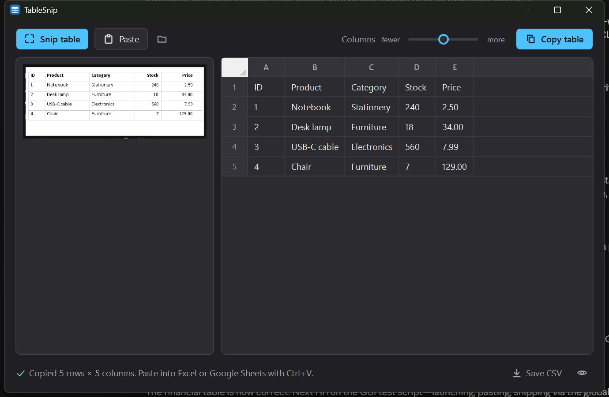

# TableSnip

Snip a table from anywhere on your screen and paste it straight into Excel or Google Sheets.



Works on any table you can *see*: a PDF, a web page, a chart in a slide deck, a screenshot someone
sent you. Everything runs on your PC, nothing is uploaded.

## Download

Grab `TableSnip-<version>-win-x64.zip` from the
[latest release](https://github.com/CognitoBit/TableSnip/releases/latest), unzip it anywhere and run
`TableSnip.exe`. No installer. Needs Windows 10 (1809+) or Windows 11 and the .NET 8 Desktop
Runtime, which Windows offers to install on first launch if it is missing.

## Use it

1. Start TableSnip.
2. Press **Snip table** (or **Ctrl+Alt+T** from any app) and drag a box around the table.
3. Switch to Excel, Google Sheets, Numbers or Word and press **Ctrl+V**.

That's it. The table is on your clipboard the moment the snip is read, so step 3 is the only thing
left to do. The window shows what was read so you can check it, fix a cell (double-click), delete a
row (select its number, press Delete) or save it as CSV.

Other ways in:

- **Ctrl+V** inside TableSnip pastes a screenshot from the clipboard (for example one taken with
  Win+Shift+S).
- Drop an image file on the window, or open one with the folder button (Ctrl+O).
- **Columns: fewer / more** slider. If two columns were glued together, drag towards *more*; if a
  column was split in two, drag towards *fewer*. The clipboard updates as you drag.

Tips for best results:

- Snip only the table, not the paragraph above it.
- Small text reads badly. Zoom the source in (Ctrl + scroll in a browser or PDF viewer) before
  snipping. Text 12 px tall or more is comfortably readable.

## How it works

- **Two OCR engines vote.** The OCR built into Windows 10/11 (`Windows.Media.Ocr`) is fast and good
  at short tokens but regularly drops numbers such as `1,200,000`. Tesseract 5 (bundled, with the
  English *fast* model) is the opposite. Each engine reads the snip twice at different scales; the
  readings are clustered by position and the text most engines agree on wins, with a small
  plausibility score to break ties (`1,ooo` loses to `1,000`).
- **Rows and columns come from geometry.** Words are grouped into rows by their vertical centre, into
  cells by the horizontal gaps between them, and cells are aligned into columns by overlap. Rows
  whose cell count matches the most common count define the column skeleton; the others are fitted
  onto it. Columns that never share a row are merged, which fixes short headers above wide
  right-aligned numbers.
- **Two clipboard formats.** Tab-separated text (what Excel and Sheets parse into cells) and an HTML
  table (what Word, Outlook and Gmail turn into a real table).

## Build

Requires the [.NET 8 SDK](https://dotnet.microsoft.com/download/dotnet/8.0) on Windows 10 (1809+)
or Windows 11.

```powershell
dotnet build src\TableSnip\TableSnip.csproj -c Release
```

## Make a distributable

```powershell
.\publish.ps1
```

This produces `dist\TableSnip\` (a single `TableSnip.exe` plus the `tessdata\` and `x64\` folders it
needs beside it) and `dist\TableSnip-win-x64.zip`, about 11 MB. Share the zip; people unzip and run.

`.\publish.ps1 -SelfContained` bundles the .NET runtime as well for PCs that don't have it (roughly
70 MB larger). The default build needs the .NET 8 Desktop Runtime, which Windows offers to install
on first launch. Tesseract's native library also needs the Microsoft Visual C++ 2015-2022
redistributable, which almost every Windows PC already has.

To publish a release on GitHub, tag a commit and push the tag:

```powershell
git tag v1.0.0
git push origin v1.0.0
```

The `Release` workflow in `.github/workflows` builds the zip on a Windows runner and attaches it to
a GitHub Release with generated notes. Every push to `main` also runs the `Build` workflow, which
uploads the zip as a downloadable artifact.

The app is not code-signed, so SmartScreen may show "Windows protected your PC" on first launch.
Click *More info* → *Run anyway*.

## Command line

TableSnip can also run headless, which is handy for scripts and for testing the table logic:

```powershell
TableSnip.exe --file table.png                 # tab-separated table on stdout
TableSnip.exe --file table.png --out table.tsv
TableSnip.exe --file table.png --copy          # put the table on the clipboard
TableSnip.exe --file table.png --json          # raw words with bounding boxes
TableSnip.exe --file table.png --gap 1.4       # column sensitivity (1 = default, >1 fewer columns)
TableSnip.exe --snip                           # start straight into snip mode
```

`tools\make-test-tables.ps1` renders a set of synthetic tables into `test-tables\` for checking
changes to the recognition or layout code.

## Project layout

```
src/TableSnip/
  Core/Recognizer.cs      runs both engines, clusters and votes
  Core/WindowsOcr.cs      Windows.Media.Ocr wrapper (de-skew, two scales)
  Core/TesseractOcr.cs    Tesseract wrapper
  Core/TableBuilder.cs    words with boxes -> rows and columns
  Core/ClipboardTable.cs  TSV + CF_HTML clipboard payloads, CSV export
  Core/ImageUtil.cs       upscaling, grayscale, alpha fixes for clipboard images
  MainWindow.xaml(.cs)    the one window
  SnipWindow.xaml(.cs)    full-screen selection overlay (one per monitor)
  Interop/HotKey.cs       global Ctrl+Alt+T
  tessdata/               Tesseract English model (Apache 2.0)
```

## Limitations

- Cells that wrap onto two lines come out as two rows.
- Merged/spanning cells are placed in their left-most column.
- English only for now. Windows OCR follows your installed language packs; Tesseract ships with
  English. Other Tesseract languages can be dropped into `tessdata\` and would need a small code
  change to be picked up.

## Licences

TableSnip itself: MIT. Tesseract and its language data: Apache 2.0.
